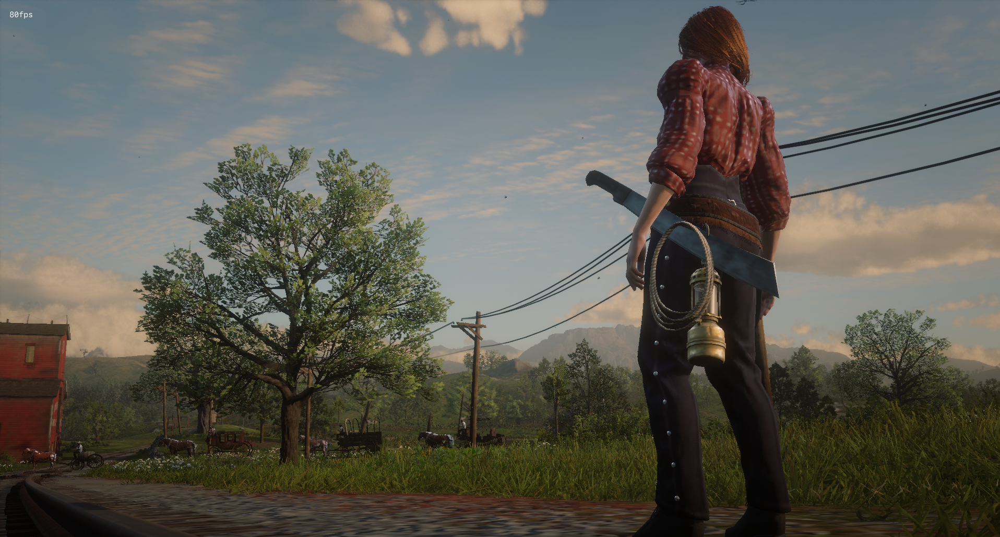
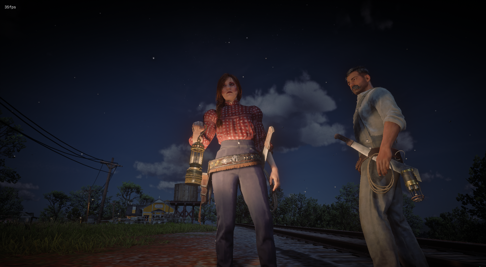

# RedM Belt Attachments


<div style="display: flex; justify-content: space-between;">
    
    
</div>

Realistically display your weapons and items on your character's belt when equipped from inventory but not in use! Works with lanterns, lassos, machetes, and more.

## Features
- Automatically shows/hides items on your belt
- Synchronized across all players - everyone sees each other's belt items
- Smooth transitions when equipping/unequipping
- Works with both male & female characters
- Fully adjustable positioning with in-game commands
- Supports multiple item types:
  - Regular and Davy lanterns
  - Regular and reinforced lassos
  - Machetes
  - Metal detector
  - And more can be easily added!

There are 5 attachements already configured for you.

## Preview
[Video Preview](https://youtu.be/6ZGfaL8W5Ng)

## Installation
1. Download the `bln_belt_attachments` script
2. Place it in your server's `resources` folder
3. Add `ensure bln_belt_attachments` to your `server.cfg`

## 🛠️ Usage
The script works automatically once installed. When you have supported items in your inventory:
- Items appear on your belt when equipped but not in active use
- Automatically hide/show items when using them
- All players can see each other's belt attachments

### Supported Items
- `WEAPON_MELEE_LANTERN` - Regular lantern
- `WEAPON_MELEE_DAVY_LANTERN` - Davy lantern
- `WEAPON_KIT_METAL_DETECTOR` - Metal detector
- `WEAPON_LASSO` - Regular lasso
- `WEAPON_LASSO_REINFORCED` - Reinforced lasso
- `WEAPON_MELEE_MACHETE` - Machete

you can support/add more items as you need!

## 🔧 Configuration
You can easily add new items or adjust existing ones by modifying the configuration file `config.lua`. Each item can be configured with:
- Attachment bone
- Position offset
- Rotation offset
- Different settings for male/female characters

Example configuration structure:
```lua
{
    hashName = 'WEAPON_MELEE_LANTERN',
    model = `s_interact_lantern01x`,
    bone = {
        male = 'PH_Lantern',
        female = 'PH_Lantern',
    },
    offset = {
        male = {
            x = 0.0,
            y = 0.0,
            z = 0.0,
            pitch = 0.0,
            roll = 0.0,
            yaw = 0.0,
        },
        female = false, -- Uses male settings if false
    },
}
```

## Support 💬
Need help? Join our Discord server:
[Join Discord](https://discord.com/invite/MEZRYQVpnt)

## Credits 🙏
Created by [BLN Studio](https://bln.tebex.io)
Feel free to contribute to this project! 

## ⚠️ Note
This script is purely cosmetic and does not affect gameplay mechanics. It's designed to enhance immersion by displaying your items realistically when not in use.

